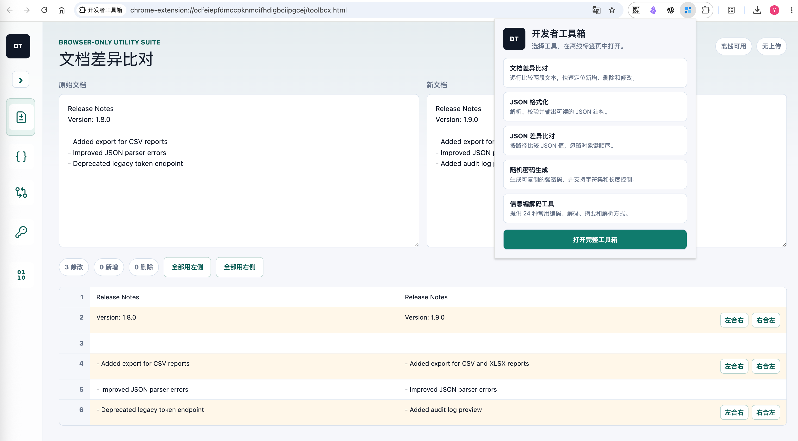

<p align="center">
  
</p>

<h1 align="center">DevTools Box</h1>

<p align="center">
  A secure, private, and ultra-fast client-side developer toolbox. 100% local computing with zero data uploads.
</p>

<p align="center">
  <a href="https://github.com/guanyang/dev-tools-box/actions/workflows/deploy-cloudflare.yml">
    
  </a>
  <a href="https://github.com/guanyang/dev-tools-box/actions/workflows/release.yml">
    
  </a>
  <a href="https://github.com/guanyang/dev-tools-box/blob/main/LICENSE">
    
  </a>
  <a href="https://vite.dev/">
    
  </a>
  <a href="https://react.dev/">
    
  </a>
  <a href="https://tailwindcss.com/">
    
  </a>
</p>

<p align="center">
  <a href="./README.md">简体中文</a> | English
</p>

<p align="center">
  
</p>

---

## ✨ Key Features

- 🔒 **100% Privacy-Focused**: All document diffing, JSON formatting, password generation, and data encoding/decoding are executed entirely in the **local browser (Client-Side)**. No data is sent to external servers, protecting your API keys, JWT tokens, and credentials.
- 🧩 **Privacy-First Browser Extension**:
  - **Zero High-Risk Permissions**: The extension does not request any host permissions (`Host Permissions`). It **does not read, sniff, or modify any page content** you visit, avoiding plugin hijacking or keylogger risks.
  - **100% Offline Package**: Packed with all computation logic and static resources. No network requests, no uploads.
  - **Cross-Browser Support**: A single codebase natively compatible with Chrome, Edge, and Firefox.
- 🎨 **Sleek UI/UX**:
  - Built with **React 19 + TailwindCSS 4.0** with smooth transitions and interactions.
  - Supports **System/Light/Dark** three-state theme preferences, saved locally in your browser.
  - Integrated with **CodeMirror** for syntax highlighting and real-time validation.
- 🔎 **Fast Tool Discovery**: Search by name or keyword, filter by category, and keep local-only favorites and recent tools.
- ⌨️ **Keyboard First**: Press `Cmd/Ctrl + K` to open the command palette, using arrow keys and Enter to search and switch tools instantly.
- 🧠 **Smart Detection and Tool Handoffs**: Content is detected only after an explicit paste, drop, or file selection. Copy, download, and “Send to” actions support typed flows such as JSON → YAML → Base64 → QR Code.
- 🧵 **Responsive Large-Input Processing**: JSON and structured-data computations run in Web Workers with progress, cancellation, and input-size guidance.
- 📲 **Installable Web App (PWA)**: The web version supports being installed as a PWA, caching core tools in the background so you can use them offline.
- 🚀 **Serverless Ready (Serverless Friendly)**: Native compatibility with Cloudflare Workers/Pages environments. Comes with pre-configured GitHub Actions workflows.

---

## 🚀 Quick Access

You can use this toolbox in the following two ways:

1. **🌐 Web Version**:
   - Access the officially hosted version at: [https://tools.xcloudapi.com/](https://tools.xcloudapi.com/)
   - Enjoy 100% local execution and privacy. Once loaded, the toolbox continues to function fully even without an internet connection.

2. **🧩 Browser Extension**:
   - Runs as a local offline bundle for enhanced security and speed.
   - Built-in extension popup interface that can be triggered in a single click.
   - Supports Chrome, Edge, and Firefox (please refer to the [Browser Extensions Guide](#extensions) for installation steps).

---

## 🧰 Included Tools

### 1. 📝 Document Diff
- Side-by-side real-time text comparison.
- Clean color-coded highlighting: "Add (Green)", "Delete (Red)", and "Modify (Yellow)".
- Support for merging changes or copying results instantly.

### 2. 🎛️ JSON Formatter
- CodeMirror-based editor supporting line numbers, matching brackets, and syntax highlighting.
- Pre-configured actions: Format (Beautify) and Minify.
- Real-time JSON validation with detailed error descriptions.

### 3. 🔍 JSON Diff
- Structural comparison for nested JSON objects.
- **Key-order independence**: Automatically ignores sorting differences in keys and focuses on content changes.

### 4. 🔑 Password Generator
- High-entropy cryptographically random passwords.
- Customizable length (1-256), batch size (1-1000), and character sets.
- Quick copy and password strength indicators.

### 5. 🧮 24 Codec Tools (Codec Engine)

| Category | Supported Methods | Description |
| :--- | :--- | :--- |
| **Encoding / Hashing** | Unicode / URL / UTF-16 | Quickly escape special and control characters |
| | Base64 / Hex | Standard encoding methods for binary data |
| | MD5 / SHA-1 / Gzip Compression | Calculate hashes locally, or compress text outputs to Base64 |
| | HTML Entities / String Escape | Escape HTML symbols to prevent XSS, or convert raw code to JS strings |
| **Decoding / Parsers** | Unicode / URL / UTF-16 Decode | Revert escaped strings |
| | Base64 / Hex Decode | Decode binary string outputs back to UTF-8 text |
| | JWT Decoder | Parse JWT headers and payloads without signatures |
| | URL Parameter Parser / Cookie Parser | Parse complex query strings or cookies into structured layouts |
| | Gzip Decompression | Decompress Gzip-compressed Base64 string values |
| | **Proto Hex Parser** | **Power Feature!** Parse Protobuf binary Hex string inputs directly into structured JSON trees |

### 6. 🪪 ID & Token Generator
- Batch-generate UUID v4, UUID v7, ULID, and URL-safe secure tokens.
- Uses browser cryptographic randomness with per-item and bulk copy actions.

### 7. #️⃣ Hash & Checksum
- Calculate SHA-256 and SHA-512 for text or local files.
- Generate HMAC values with a user-provided key without uploading data.

### 8. 🕐 Time & Cron
- Detect second or millisecond Unix timestamps and display common time zones.
- Parse standard five-field Cron expressions and list upcoming runs.

### 9. 🧪 Regex Tester
- Preview matches, offsets, captures, named groups, and replacement output in real time.
- Supports the `g`, `i`, `m`, `s`, and `u` flags.

### 10. 🔄 Structured Data Workbench
- Convert between JSON, YAML, XML, TOML, and CSV.
- Perform JSONPath queries on JSON inputs, and validate data locally using JSON Schema.
- Format Standard SQL, MySQL, PostgreSQL, SQLite, SQL Server, and PL/SQL.

### 11. 🛡️ JWT / JWK Verification
- Inspect JWT headers, payloads, and time claims with explicit expiry, not-before, and algorithm warnings.
- Verify HMAC, RSA, RSA-PSS, and ECDSA signatures locally with browser Web Crypto and a JWK.
- Tokens and keys stay in current-page memory and are never written to history or URLs.

### 12. ▦ QR Code Generator
- Generate a local PNG QR Code from text, URLs, Base64, or another tool's output.
- Copy or download the result and use it as the endpoint of a JSON → YAML → Base64 workflow.

---

## 🛠️ Tech Stack

- **Core Framework**: [React 19](https://react.dev/) + [TypeScript](https://www.typescriptlang.org/)
- **Build System**: [Vite 8](https://vite.dev/) + [Vinext](https://github.com/vinext) (for high-performance multi-page edge rendering)
- **CSS Engine**: [TailwindCSS 4.0](https://tailwindcss.com/)
- **Core Components**:
  - [@uiw/react-codemirror](https://github.com/uiwjs/react-codemirror) - Integrated professional code editor.
  - [@noble/hashes](https://github.com/paulmillr/noble-hashes) - Pure JS implementation of cryptographic hash functions.
  - [yaml](https://eemeli.org/yaml/) / [JSONPath Plus](https://github.com/JSONPath-Plus/JSONPath) / [@cfworker/json-schema](https://github.com/cfworker/cfworker/tree/main/packages/json-schema) - Local data conversion, querying, and CSP-safe Schema validation.
  - [qrcode](https://github.com/soldair/node-qrcode) - In-browser QR Code generation.
  - [lucide-react](https://lucide.dev/) - Modern icon assets.

---

## 🛠️ Development Guide

### Prerequisites
- **Node.js** `>=22.15.0`
- **npm** `>=10.0.0`

### Local Setup
1. Clone and enter the directory:
   ```bash
   git clone https://github.com/guanyang/dev-tools-box.git
   cd dev-tools-box
   ```
2. Install dependencies:
   ```bash
   npm install
   ```
3. Start the dev server:
   ```bash
   npm run dev
   ```
   Open `http://localhost:3000` in your browser.

### Test and Build
- Run the full test suite (unit and E2E tests):
  ```bash
  npm test
  ```
- Build production bundle:
  ```bash
  npm run build
  ```

---

## 🧩 <span id="extensions">Browser Extensions</span>

This project supports packing offline extensions for Chrome, Edge, and Firefox.

### 📦 For Users (Installation from release ZIP)

No need to install Node.js or run any compilation commands:

1. Go to the [GitHub Releases](https://github.com/guanyang/dev-tools-box/releases) page and download the ZIP pack for your browser (e.g. `dev-tools-box-chrome-v1.0.0.zip`).
2. Extract the downloaded ZIP archive into a local folder.
3. Load the unpacked extension by following the [⚙️ Installation Guide](#extension-install) below.

---

### 🛠️ For Developers (Build and debug from source)

If you wish to modify the extension code:

```bash
# Debug in developer mode (Chrome example)
npm run extension:dev

# Build production bundle (outputs to dist-extension/<browser>/)
npm run extension:build

# Build and package versioned ZIP files (outputs to artifacts/)
npm run extension:package
```

---

### ⚙️ <span id="extension-install">Installation Guide</span>

- **Chrome / Edge**:
  1. Open `chrome://extensions/` (or `edge://extensions/`) in your browser.
  2. Enable **Developer Mode** in the top right corner.
  3. Click **Load unpacked**.
  4. Select the folder you extracted (or choose `dist-extension/chrome` or `dist-extension/edge` if you compiled it yourself).
- **Firefox**:
  - **Temporary (Lost on browser restart)**:
    1. Open `about:debugging#/runtime/this-firefox` in the address bar.
    2. Click **Load Temporary Add-on**.
    3. Choose `manifest.json` under your extracted folder (or under `dist-extension/firefox/`).
  - **Permanent (Recommended for general use)**:
    By default, standard Firefox does not allow loading unsigned local extensions permanently. You can use one of these approaches:
    - **Method 1: Self-sign the extension (Works in any Firefox version)**
      1. Upload the generated `.zip` extension to the [Firefox Add-on Developer Hub (AMO)](https://addons.mozilla.org/developers/).
      2. Choose **"On your own / Unlisted"** during submission (strictly for personal signing, no public review needed).
      3. The automatic scanner will sign and approve it in a few minutes.
      4. Download the signed `.xpi` file and drag it into `about:addons` to install it permanently.
    - **Method 2: Use Firefox Developer Edition / Nightly / ESR**
      1. Open `about:config` in the address bar and press Enter.
      2. Search for `xpinstall.signatures.required` and set it to `false`.
      3. Open `about:addons`, click the gear icon in the top right, select "Install Add-on From File...", and select the generated `.zip` or `.xpi` file.

---

## 🌐 Deployment

Perfect native support for **Cloudflare Workers** (Wrangler) with automated CI/CD:

- Every push to the `main` branch triggers `.github/workflows/deploy-cloudflare.yml` to compile and run tests.
- **Smart Incremental Deployment**: The workflow computes the checksum hash of the `dist/` build directory. **Actual deployment is skipped if the build output is unchanged**, conserving Actions runner minutes.
- **Forced Deployment on Release**: Publishing a new Release overrides the hash check and forces a clean deployment of the tag's state.

### Actions Secrets Configuration
Configure the following Repository Secrets under `Settings -> Secrets and variables -> Actions` in your GitHub repository:
- `CLOUDFLARE_API_TOKEN`: Cloudflare token with Workers deployment permissions.
- `CLOUDFLARE_ACCOUNT_ID`: Your Cloudflare Account ID.

---

## 📦 Release

A pre-packaged CLI script handles local Tag pushes and automated releases:

1. Write the release log details in `CHANGELOG.md` (e.g. `## [v1.0.0] - 2026-07-11`).
2. Run the release command:
   ```bash
   ./scripts/release.sh 1.0.0
   ```
3. The script verifies git status, tags the commit, and pushes it to GitHub.
4. The `.github/workflows/release.yml` workflow triggers on the new tag push:
   - Extracts the corresponding release notes from `CHANGELOG.md`.
   - Packages browser extensions for Chrome, Edge, and Firefox into ZIP folders.
   - Publishes a new GitHub Release with the ZIP files attached.

---

## 📄 License

This repository is licensed under the [MIT License](LICENSE).
